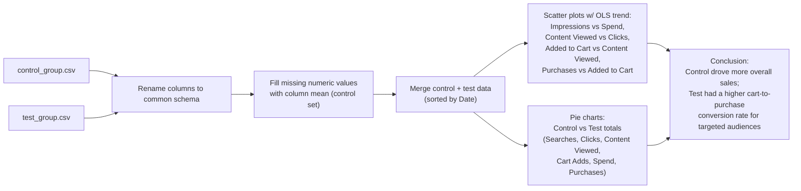

# Best Market Strategy Analysis

A single Jupyter notebook that runs an A/B test comparison between a "control" and a "test" marketing campaign (`control_group.csv` / `test_group.csv`), analyzing ad spend, impressions, reach, clicks, searches, content views, cart adds, and purchases to determine which campaign strategy performs better.

## Tech stack

- Python
- pandas
- Plotly (`plotly.express`, `plotly.graph_objects`) with OLS trendlines for scatter plots and pie/bar charts

## Architecture

## Setup / How to run

The repo contains only the notebook, `Best Market Strategy Analysis.ipynb`; the source CSVs (`control_group.csv`, `test_group.csv`, semicolon-delimited) are not included in the repository and must be supplied separately to reproduce the analysis.

1. Install dependencies: `pip install pandas plotly statsmodels` (statsmodels is required for the OLS trendlines used by Plotly)
2. Place `control_group.csv` and `test_group.csv` in the same directory as the notebook.
3. Open and run `Best Market Strategy Analysis.ipynb` in Jupyter.
